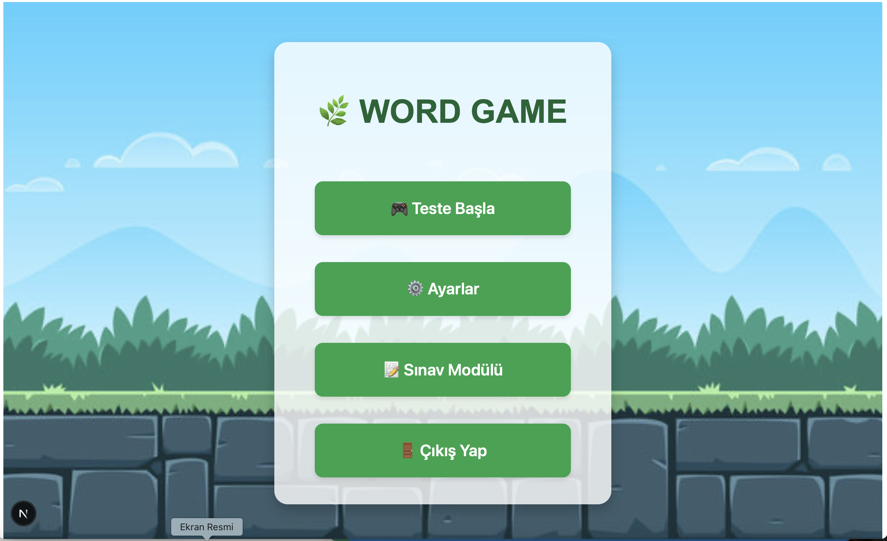
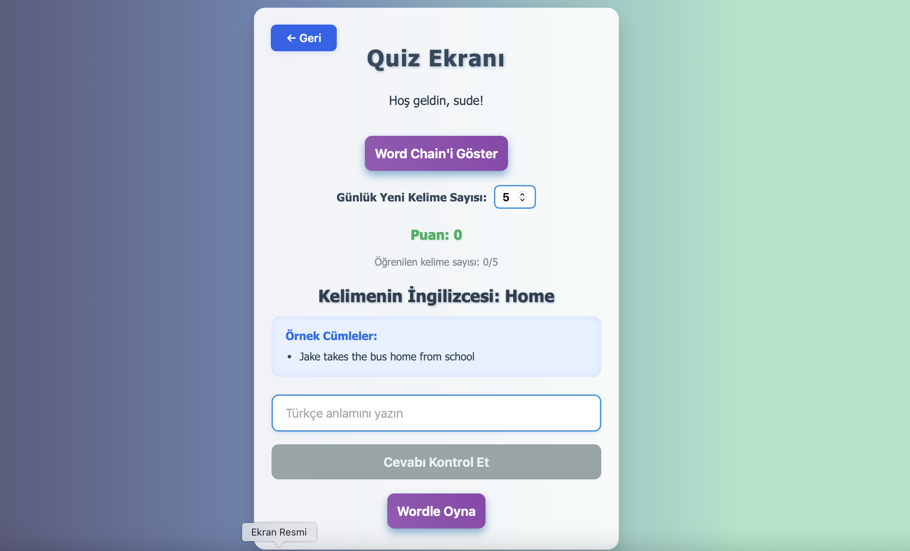
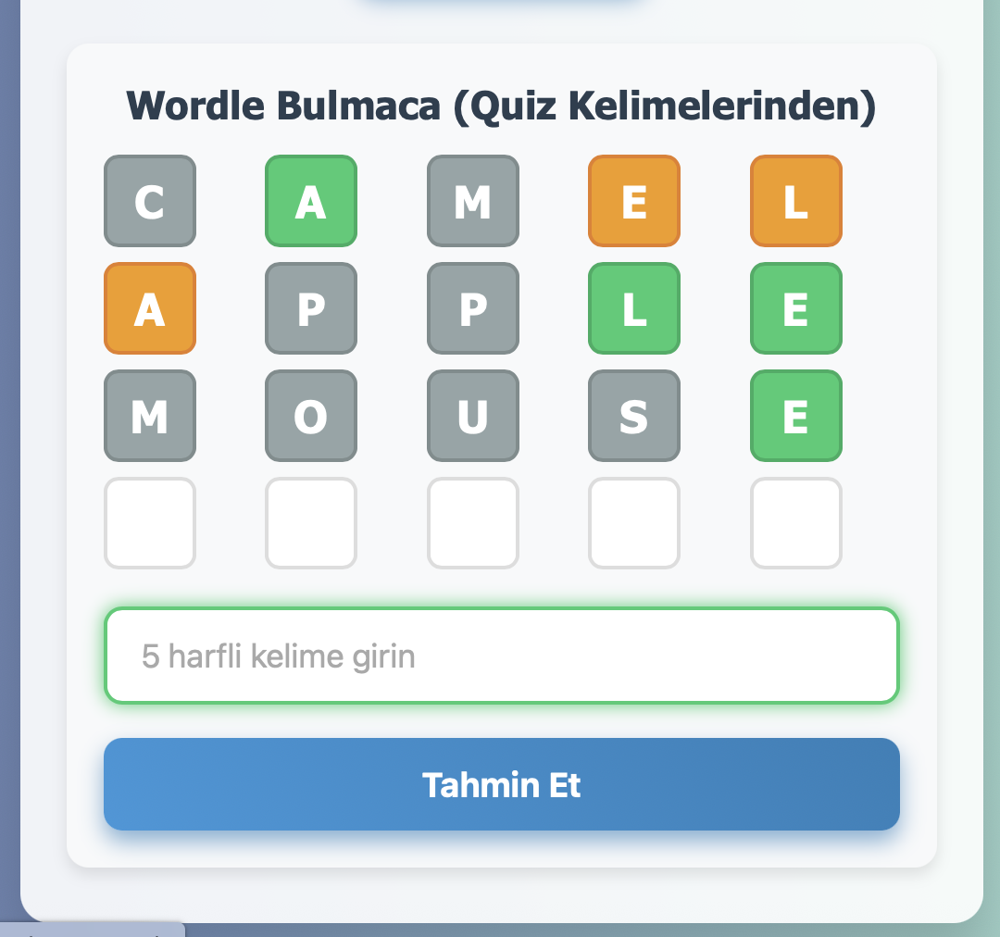

# 📚 6 Tekrar Prensibi ile Kelime Ezberleme Oyunu

Bu proje, kullanıcılara bilimsel olarak kanıtlanmış "6 tekrar" öğrenme yöntemini oyunlaştırarak sunar. Wordle benzeri oyunlar, günlük testler ve kullanıcıya özel kelime havuzlarıyla zenginleştirilmiş bir İngilizce öğrenme uygulamasıdır.

---

## 🚀 Uygulama Özellikleri

- 🎮 Wordle tarzı kelime tahmin oyunu
- 🔁 6 sefer tekrar algoritması
- 💡 Bilinen/bilinmeyen kelime takibi
- 📘 Günlük kelime sınırı ayarlama
- 🧠 Kişiselleştirilmiş quiz ve test ekranı
- 🧹 Word Chain mini oyunları
- 🔐 Kullanıcı oturum yönetimi

---

## 🖼️ Uygulama Görselleri

### 🏠 Ana Sayfa



### 🎯 Quiz Ekranı (Kelime Testi)



### 🎮 Wordle Oyunu



---

## ⚙️ Teknolojiler

| Katman     | Teknoloji                  |
| ---------- | -------------------------- |
| Frontend   | React (Next.js)            |
| Backend    | .NET 7 Web API             |
| Veritabanı | MSSQL                      |
| Stil       | TailwindCSS, CSS           |
| Araçlar    | GitHub, Trello, SonarCloud |

---

## 🧪 Kurulum

### 1. Repoyu Klonlayın

```bash
git clone https://github.com/Sude2012/wordGameWeb.git
```

### 2. Frontend (Next.js) Kurulumu

```bash
cd frontend
npm install
npm run dev
```

### 3. Backend (.NET) Kurulumu

```bash
cd backend
dotnet run
```

> Backend ve frontend farklı portlarda çalışır. CORS ayarları yapılmıştır.

---

## 📈 Kod Kalitesi (SonarCloud)

- SonarCloud ile analiz entegre edildi
- GitHub Actions ile otomatik tetikleniyor
- Kod kokuları, duplication, test coverage analiz edildi

> ⚡ SonarCloud özeti: A - B kalite notu, 0 security issue, 0.5% duplication

---

## ✅ Scrum Takibi

Projede Scrum metodolojisi uygulanmıştır. Tüm görevler Trello panosunda takibe alınmıştır.

- [x] Kullanıcı Girişi
- [x] Wordle Oyunu
- [x] 6 Tekrar Modülü
- [x] Quiz Sistemi
- [x] Backend API'leri
- [x] Kod Kalitesi Analizi (SonarCloud)
- [x] Trello Scrum Tablosu

---

## 👩‍💼 Geliştirici

**Selver Sude Özdemir & Burak Akbulut**  
Yazılım Mühendisliği

---

## 📌 Not

Bu proje yazılım geliştirme dersi kapsamında hazırlanmıştır. Amacı, ezberlemeyi bilimsel prensiplerle oyunlaştırmak ve öğrenmeyi keyifli hale getirmektir.
